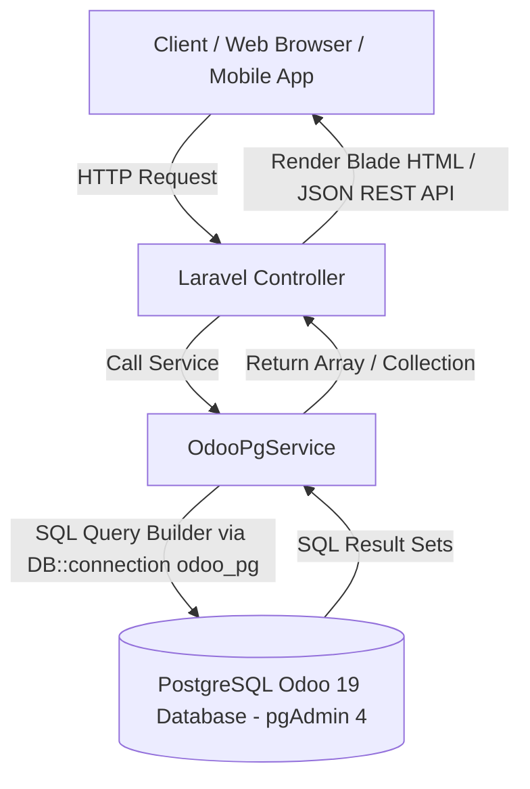

# Struktur & Dokumentasi Project Laravel x Odoo 19 Direct PostgreSQL Integration

Project **`laravelxodoo19`** adalah aplikasi **Laravel** yang dirancang sebagai **Bridge / Gateway Integration** berkecepatan tinggi antara Laravel dan ERP **Odoo 19** menggunakan **Direct PostgreSQL Database Connection** (`odoo_pg`) yang diakses via pgAdmin 4.

Aplikasi ini memiliki 2 pilar utama:
1. **Web Dashboard (MVC)**: Antarmuka berbasis Blade UI (HTML/CSS) untuk menampilkan data Odoo (Purchase Orders, Sales Orders, Admin Dashboard) langsung dari database PostgreSQL.
2. **REST API Suite Layer**: API perantara bagi aplikasi eksternal (Mobile App, Next.js, Frontend Vue/React) untuk mengambil data dari database PostgreSQL Odoo 19.

---

## 🏗️ Arsitektur Sistem



---

## 📂 Rincian Struktur Direktori & File

```
laravelxodoo19/
├── app/
│   ├── Http/
│   │   ├── Controllers/
│   │   │   ├── AdminController.php          # Controller untuk Dashboard Admin
│   │   │   ├── AuthController.php           # Controller untuk Web Auth (Login/Logout)
│   │   │   ├── PurchaseOrderController.php  # Controller Web Purchase Orders (PostgreSQL Direct)
│   │   │   ├── SalesOrderController.php     # Controller Web Sales Orders (PostgreSQL Direct)
│   │   │   └── Api/
│   │   │       ├── ApiAuthController.php    # REST API Auth (Login/Logout/Me)
│   │   │       ├── ApiCustomerController.php# REST API Customer (res_partner)
│   │   │       ├── ApiProductController.php # REST API Product (product_template)
│   │   │       ├── ApiPurchaseController.php# REST API Purchase Order (purchase_order)
│   │   │       ├── ApiSaleController.php    # REST API Sales Order (sale_order)
│   │   │       └── ApiStockController.php   # REST API Inventory/Stock (stock_picking)
│   ├── Models/
│   │   └── User.php                         # Model User Laravel
│   └── Services/
│       └── OdooPgService.php                # Service Engine Direct PostgreSQL Odoo 19
├── config/
│   ├── database.php                         # Konfigurasi koneksi database 'odoo_pg' (PostgreSQL)
│   └── odoo.php                             # File konfigurasi Odoo
├── resources/
│   └── views/
│       ├── admin/
│       │   └── dashboard.blade.php          # Dashboard Admin View
│       ├── auth/
│       │   └── login.blade.php              # Login View
│       ├── purchase-orders/
│       │   └── index.blade.php              # UI Daftar & Filter Purchase Orders (PostgreSQL)
│       └── sales-orders/
│           └── index.blade.php              # UI Daftar & Filter Sales Orders (PostgreSQL)
├── routes/
│   ├── api.php                              # Endpoint REST API Suite Odoo Integration
│   └── web.php                              # Web Dashboard Routes (Blade UI)
├── .env                                     # Environment Variable (Kredensial PostgreSQL)
├── PANDUAN-SETUP.md                         # Panduan Setup & Koneksi
└── README.md                                # Overview project
```

---

## 🛠️ Detail Komponen Utama

### 1. Layer Service (`app/Services/`)
*   **`OdooPgService.php`**: Engine Query utama ke PostgreSQL Odoo 19 via `DB::connection('odoo_pg')`. Menggunakan Query Builder Laravel dengan teknik `JOIN` tabel relational (misal: `purchase_order` JOIN `res_partner`) untuk membaca data berkecepatan tinggi tanpa overhead HTTP.

### 2. Layer Controller (`app/Http/Controllers/`)
*   **Web Controllers**: Menangani tampilan berbasis Blade untuk pengguna akhir yang mengakses via browser web.
*   **API Controllers (`Api/`)**: Menangani pertukaran data berbasis JSON untuk konsumsi API pihak ketiga / frontend terpisah.

### 3. Layer Views (`resources/views/`)
Menggunakan Blade Template Engine dengan styling modern & responsive untuk menampilkan data dari database PostgreSQL Odoo 19.

---

## 🛣️ Daftar Route & Endpoint

### Web Routes (`routes/web.php`)
| Method | Route | Controller Method | Fungsi | Sumber Data |
|---|---|---|---|---|
| GET | `/login` | `AuthController@showLogin` | Halaman Form Login | Database Local |
| POST | `/login` | `AuthController@login` | Proses Login | Database Local |
| POST | `/logout` | `AuthController@logout` | Proses Logout | Database Local |
| GET | `/admin/dashboard` | `AdminController@dashboard` | Dashboard Admin | Database Local |
| GET | `/purchase-orders` | `PurchaseOrderController@index` | Daftar Purchase Order Odoo | PostgreSQL `purchase_order` |
| GET | `/sales-orders` | `SalesOrderController@index` | Daftar Sales Order Odoo | PostgreSQL `sale_order` |

### REST API Routes (`routes/api.php`)
| Method | Endpoint | Description | Tabel PostgreSQL Odoo |
|---|---|---|---|
| POST | `/api/login` | API Login | User Auth |
| GET | `/api/me` | Check Profile | User Auth |
| GET | `/api/products` | Get Products | `product_template` |
| GET | `/api/products/{id}` | Detail Product | `product_template` |
| GET | `/api/customers` | Get Customers | `res_partner` |
| GET | `/api/customers/{id}` | Detail Customer | `res_partner` |
| GET | `/api/sales` | Get Sales | `sale_order` |
| GET | `/api/sales/{id}` | Detail Sale | `sale_order` |
| GET | `/api/purchases` | Get Purchases | `purchase_order` |
| GET | `/api/purchases/{id}` | Detail Purchase | `purchase_order` |
| GET | `/api/stocks` | Get Stocks | `stock_picking` |

---

## ⚙️ Konfigurasi Environment (`.env`)

```env
# Koneksi PostgreSQL Odoo 19 (pgAdmin 4)
ODOO_DB_PG_CONNECTION=pgsql
ODOO_DB_PG_HOST=127.0.0.1
ODOO_DB_PG_PORT=5432
ODOO_DB_PG_DATABASE=odoo_val
ODOO_DB_PG_USERNAME=openpg
ODOO_DB_PG_PASSWORD=openpgpwd
```
